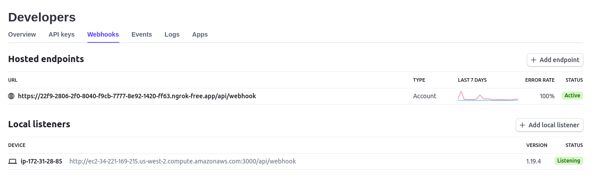
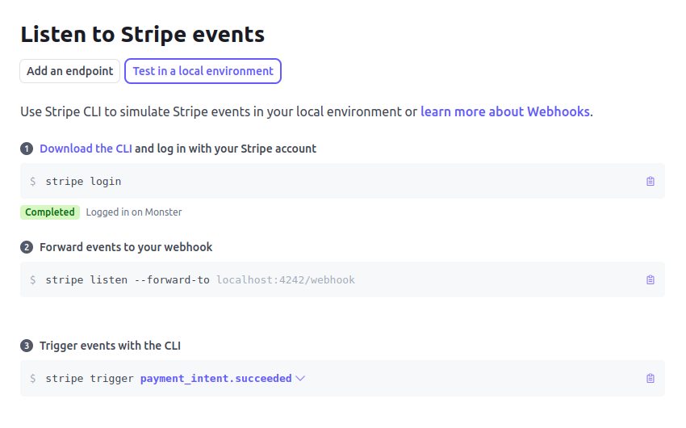
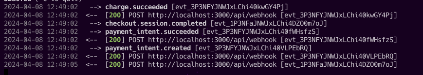

## Configuration with Stripe.

The platform uses the Stripe API for the payment gateway, the system only allows saving user data and purchase details (tickets) only when the payment is successful, so a webhook is implemented to notify when this happen:

1. Once you can access the Stripe account, you must check the local webhook Dashboard > Developers > Webhooks and where it says **Local listeners**

> [!IMPORTANT]
> Remember to be in **Test mode** to configure your webhook.

2. In the image you can see that there are two options; **Hosted endpoints** and the **Local listeners**, to configure your webhook locally you will click on the button that says **"+ Add local listener"**

 

3. You will have to follow the steps in the Stripe documentation, download and configure the **Stripe CLI**:

> [!IMPORTANT]
> In step two instead of putting **localhost:4242/webhook** you should put **localhost:3000/api/webhook**. This is because the API is configured this way, you can check it by looking at the routes.

 

4. Now if you try to do tests with the payment gateway with Stripe you will notice that request 200 OK appears:

 
